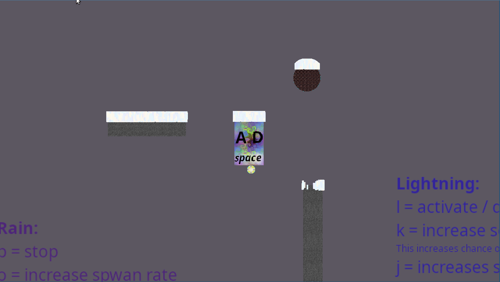
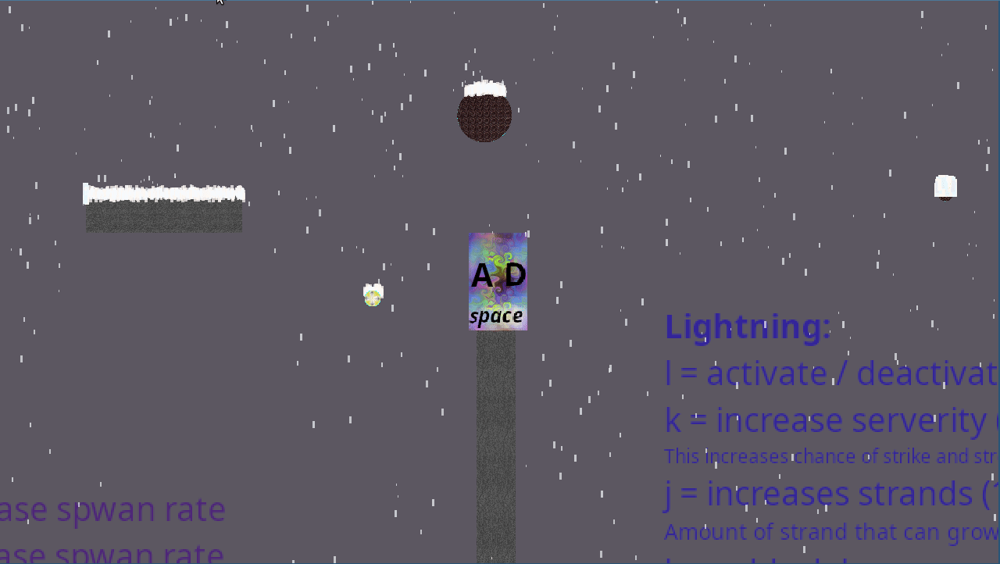

# WeatherGen v1.0


The next project I wanted to give a bit of graphic's a go. I decided on the learning the SDL2 API, whilst building a C lib for it. During development I found the use of Arena Style memory
management to be fantasic and to show it off I built a little weather generator. Easily protatble to your projects!! Never has boring weather again :)

I built this little demo to show off the WeatherGen, download the Project, run the make file, and give it a go!
Requirements are SDL2 libs installed on your system.

-> Standalone demo for Linus and Windows is now available to download from the Releases page!! <-

### Weather Effects

*Excuse the janky gifs, I promise the game play was smooth*

#### Rain

Spwans rain particals inside a Weather Box that fall to the ground with increasing speed as the drop size increases in relation to drops per second. Once in contact with collision, play out a little splash death animation

Adjustment controls
- Drop count per second
- Wind


#### Lightning

Spwans evolving Lightning Strikes within a Weather Box, evolves with relation intensity and strand count settings. Lights up any Rain particals in the scene when strike occurs

Adjustment controls
- Serverity (increaing the chance of strike and strand intensity)
- Strand Count (caps the maximum number of strands to spwan per strike)
- Delay (adds timed cooldown between strike coming back online)


#### Snow 

Spwans snow particals inside a Weather Box that fall down with increasing speed and size in relation to the per second spwan count. Once in contact with collision they build up a snow pile, as long as there is room in the laying snow count (1/4 of max spwan rate). 
When another collision object comes into collision with teh snow pile they had a death animation taking into account which direction they are approached from.

Adjustment controls
- Snow count per second
- Wind






### Installation

Either clone the reop for Just download the lib's and include them in your project.

direct lib download link
```bash
curl -L https://github.com/JackpunktG/WeatherGen/archive/refs/heads/main.zip -o repo.zip
unzip repo.zip
mv WeatherGen-main/lib/ lib/
rm -r WeatherGen-main/ repo.zip
``````

Requirements for the WeatherGen lib is the SDL2 lib, arena_memory lib and the Collision Object list in SDL2. So if you want to use it with your own SDL2 implementations just copy use the CollisionObjectList_SDL2 lib
and combine it with your own SDL2 project and change around the commentted out #includes. I've also include my SDL2 lib implementation by defualt for ease of use.

Using the Collision object list is simple, just create a CollisionObjectList and add any objects you want the weather to interact with. Have a look in the header file for more info on what types of objects you can add.
You will need to redefine my Box type as that is the main Charater that will interact with the snow, but just treat it as an SDL_Rect.


### Usage
To use the WeatherGen lib in your project just include the header file and link the WeatherGen lib to your project. 

Set up your collision objects like so:
```c
CollisionObjectList* environmentCollision = collision_object_list_init();
BoundingBox* screenBox = bounding_box_init_screen(LEVEL_WIDTH, LEVEL_HEIGTH, environmentCollision);
CollisionRect* box2 = collision_rect_init(800, 775, 50, 300, &rectTexture, environmentCollision);
CollisionCircle* circle1 = collision_circle_init(810, 500, 35, &circleTexture, environmentCollision);
```
The screen box is important as it defines the bounds of the weather effects.

Then init the WeatherMachine with your desired settings:
```c
WeatherMachine* wm = weather_machine_init(100000, 3, 1, 5, 100000, screenBox, environmentCollision);
````

Then in your game loop just update and render the weather machine:
```c
rain_spwan(wm->rainMachine, screenBox, deltaTime);
rain_update(wm->rainMachine, screenBox, deltaTime, wm->wind, environmentCollision);

lightning_machine_update(wm->lightningMachine, screenBox, deltaTime);
lightning_strand_grow(wm->lightningMachine, screenBox, deltaTime);

snow_spwan(wm->snowMachine, screenBox, deltaTime);
snow_update(wm->snowMachine, screenBox, deltaTime, wm->wind, environmentCollision);

weather_machine_render(wm, window.renderer, screenBox, &window.camera, deltaTime);
```

All the weather setting for Snow and Rain are accessable and can be changed except for the max counts after runtime.
For the lightning att the setting expect for maxStrand are easily accessable.
To adjust the lightning strands during runtime
```c
lightning_machine_destroy(wm->lightningMachine);
wm->lightningMachine = NULL;
wm->lightningMachine = lightning_machine_init(newCount, frequence, Serverity);
wm->lightningMachine->active = true;
```

Lastly free the weather machine when your done with it:
```c
weather_machine_free(wm);
```


Have fun :)


### License
This project is licensed under the MIT License - see the [LICENSE](LICENSE) file for details.
